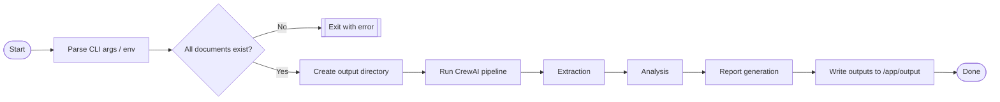
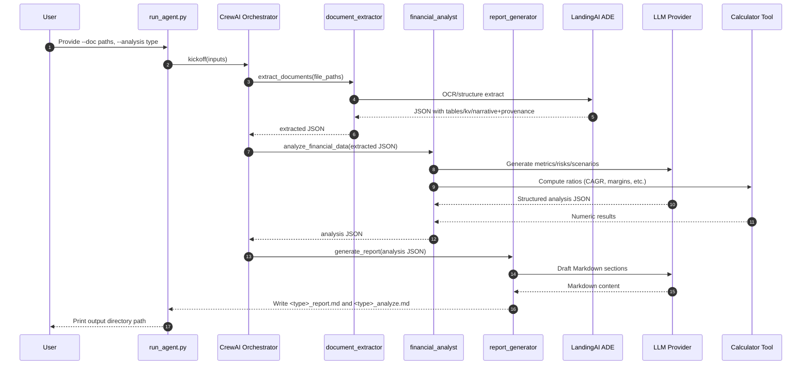
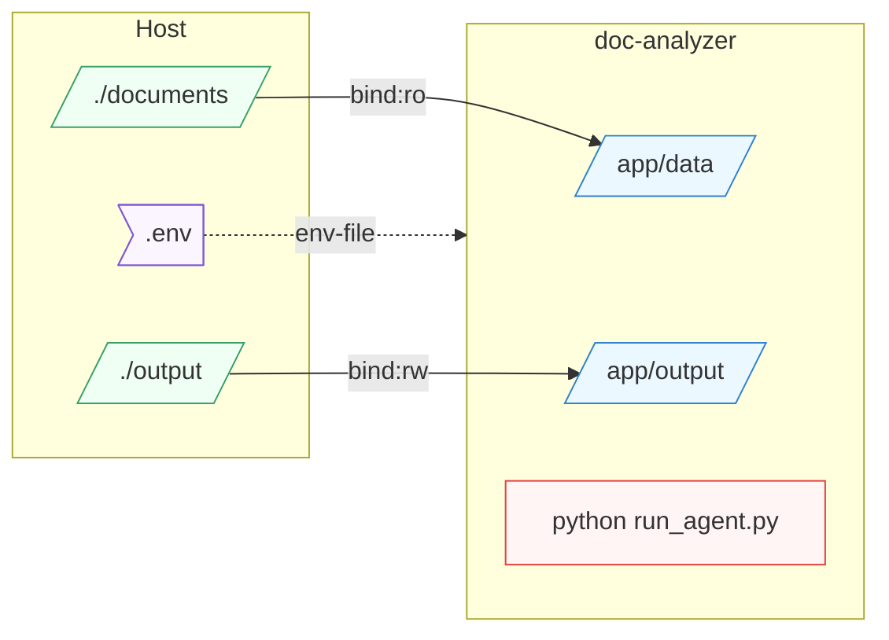

# DocAnalizer — System Presentation

A concise, visual walkthrough of the DocAnalizer system: components, data flow, runtime sequence, and deployment.

## 1) What it does (1 slide)
- Ingest financial PDFs
- Extract structured data with provenance
- Analyze metrics, risks, and scenarios
- Generate a stakeholder-ready Markdown report

Inputs: One or more PDF files
Outputs: Two Markdown files in `output/`:
- `<analysis_type>_analyze.md` (structured analysis dump)
- `<analysis_type>_report.md` (final report)

## 2) Architecture overview (diagram)
```mermaid
graph TD
  U((User)) -->|PDF(s)| D[/documents/]
  D --> EX[Extraction Agent]
  EX -->|JSON+Provenance| AN[Financial Analyst Agent]
  AN -->|Metrics+Scenarios| RG[Report Generator Agent]
  RG -->|Markdown Report| O[(output/)]

  EX -.calls.-> ADE[(LandingAI ADE API)]
  AN -.prompts.-> LLM[(LLM Provider)]
  AN -.computes.-> CALC[(Calculator Tool)]
  RG -.optional.-> PUSH[(Pushover)]

  classDef ext fill:#F6F8FF,stroke:#6B8EFF;
  classDef api fill:#FFF7E6,stroke:#FFB020;
  class EX,AN,RG ext;
  class ADE,LLM,CALC,PUSH api;
```

## 3) End-to-end system flow (flowchart)


## 4) Runtime sequence (agents, tools, providers)


## 5) Deployment view (Docker + volumes)


## 6) Key components (cheat sheet)
- Crew: `DocAnalizer` in `src/doc_analizer/crew.py`
- Agents: `document_extractor`, `financial_analyst`, `report_generator`
- Tools: `LandingAIDocumentExtractor`, `CalculatorTool`, `PushoverNotifier (optional)`
- Config: `src/doc_analizer/config/agents.yaml`, `src/doc_analizer/config/tasks.yaml`
- CLI: `run_agent.py` (accepts `--doc` multiple times, `--analysis`, `--output-dir`)

## 7) Run options
- Local: `python run_agent.py --doc path/to.pdf --analysis "financial report"`
- Docker Compose:
  - Place PDFs in `./documents`
  - Outputs appear in `./output`
  - Example:
    - `docker-compose run --rm doc-analyzer --doc /app/data/your.pdf --analysis "financial report"`

## 8) Notes and assumptions
- Requires valid API keys for LandingAI and an LLM provider (OpenAI, Groq, etc.)
- Large PDFs and image-heavy scans will increase extraction time
- Outputs are deterministic only to the extent of fixed prompts/model settings

---
This presentation is auto-generated to reflect the current repository structure and runtime flow. Adjust diagrams as you customize agents, tools, or deployment.
